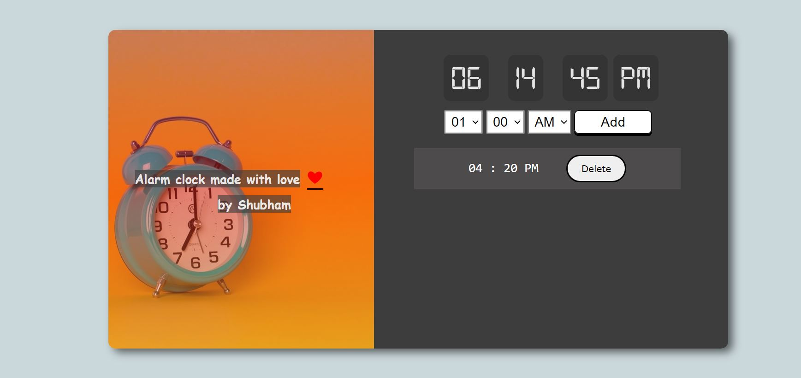
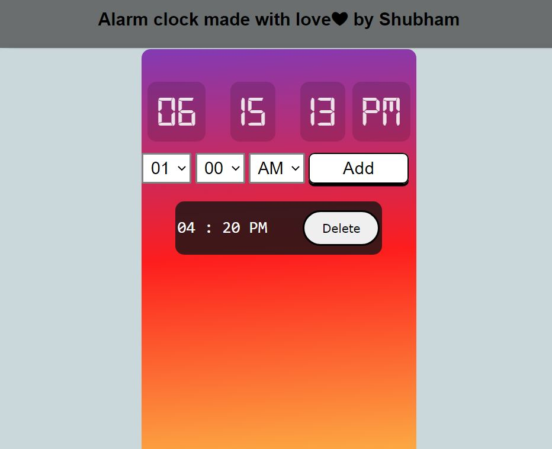

<!DOCTYPE html>
<html lang="en">
  <head>
    <meta charset="UTF-8" />
    <meta http-equiv="X-UA-Compatible" content="IE=edge" />
    <meta name="viewport" content="width=device-width, initial-scale=1.0" />
   
  </head>
  <body>
    <h2>Alarm Clock</h2>
    

    A simple alarm clock that lets the user set alarms and delete them. All the
    alarms are shown in a list. click here to visit app. App Interface Alarm
    Clock
    

    Alarm List Features Clock with current time Use Add to add new alarms Delete
    alarms to prevent them from alerting 
Mobile View
  
<strong><u>Tech Used</u></strong> 
HTML 
CSS 
Vanilla Javascript
  </body>
</html>
